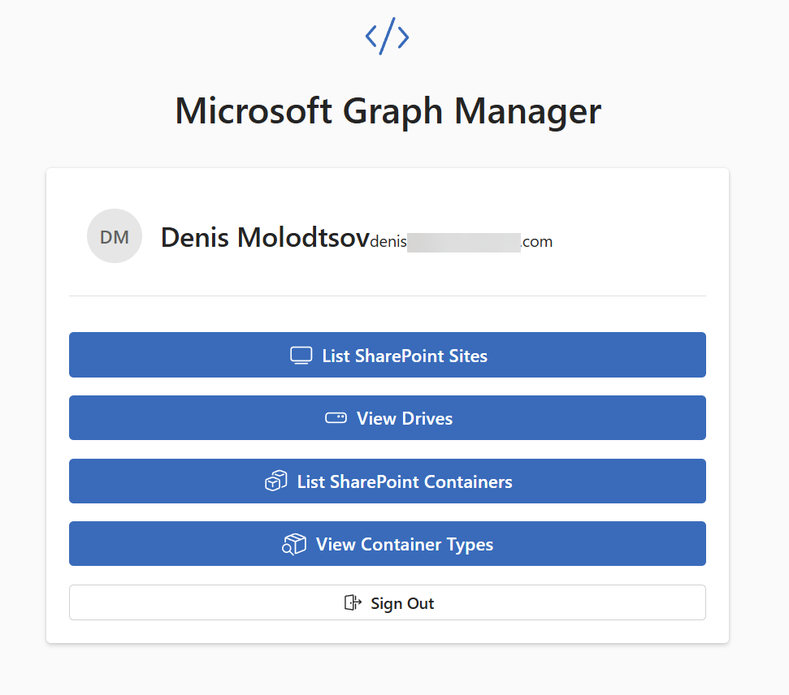

# Microsoft Graph API Manager

This is a SPA web application that allows users to use Microsoft Graph API to manage their Microsoft 365 resources.

In this build it should be possible to authenticate with Microsoft 365 and get the list all Sharepoint sites, Drives, and SharePoint containers using Microsoft Graph API.

For SharePoint containers, you can also view available container types to find the necessary GUIDs for querying containers.

Then, for each site it should be possible to get the list of all drives and for each drive it should be possible to get the list of all files.

